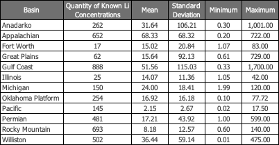
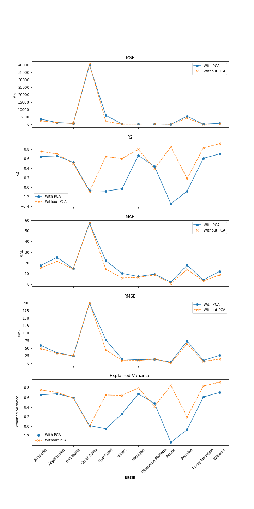
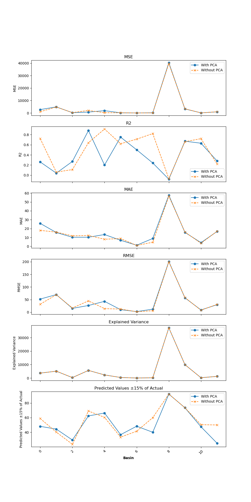
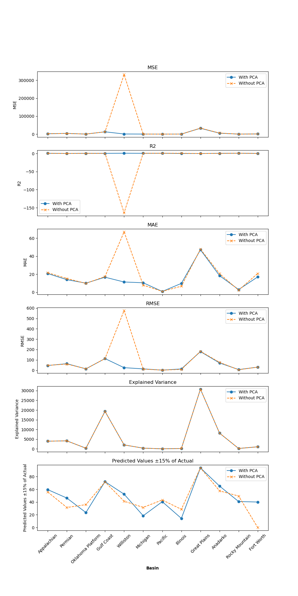
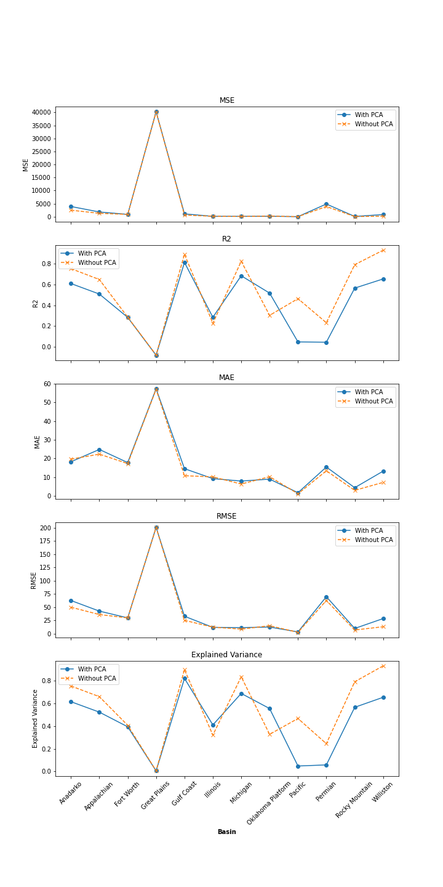
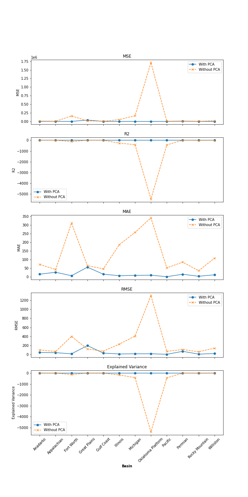
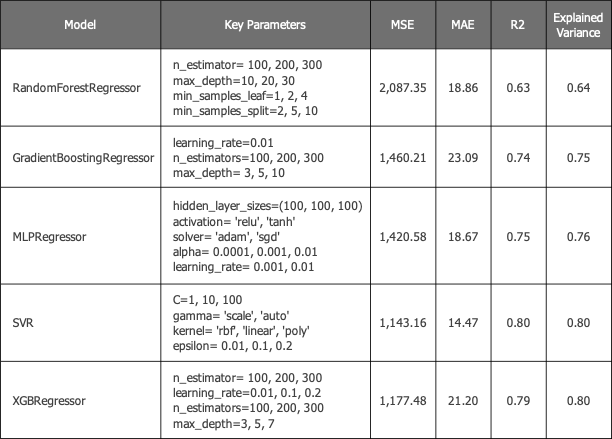

# Lithium Concentration Prediction Using Machine Learning Techniques

## 
Table of Contents

[1. Introduction](#1-introduction)  
[2. Data Preparation](#2-data-preparation)  
[3. Amazon RDS](#3-amazon-rds)  
[4. Imputation Strategy](#4-imputation-strategy)  
[5. Heatmap Analysis](#5-heatmap-analysis)  
[6. Principal Component Analysis (PCA)](#6-principal-component-analysis-pca)  
[7. Predictive Modeling](#7-predictive-modeling)  
[8. Conclusion](#8-conclusion)  
[9. Technologies](#9-technologies)  
[10. Data Sources](#10-data-sources)  
[11. Contributors](#11-contributors)

## 
1. Introduction

In this report, we present an analysis of geochemical data of produced water samples, obtained from the [U.S. Geological Survey](https://www.sciencebase.gov/catalog/item/64fa1e71d34ed30c2054ea11). Our objective is to apply statistical and machine learning techniques to predict Lithium (Li) concentrations in produced water from oil and gas production. Data preprocessing encompasses Principal Component Analysis (PCA), iterative imputation techniques to handle null values, and spearman correlation heatmaps. The machine learning models utilized in this project include Gradient Boosting (GB), Random Forest (RF), Neural Networks (NN), K-Nearest Neighbor (KNN), and Support Vector Regression (SVR).

## 
2. Data Preparation

The raw dataset was subjected to several preprocessing steps to ensure its readiness for analysis:

- **General Cleaning**: Irrelevant columns, such as identifiers and categorical data, were removed. This step was crucial to focus the analysis on quantitative geochemical features.
- **Well Type Filtering**: To ensure our study focused on the high-salinity produced water typical in oil and gas operations, we excluded well samples from coal, injection, and geothermal plays. This approach keeps our analysis relevant to the typical environmental and production challenges in the oil and gas industry.
- **Basin Categorization**: Well samples were categorized based on the basin they belong to. This categorization helps to group samples by geographical and geological features.
- **Technical Cleaning**: In the dataset preprocessing phase, observations with Total Dissolved Solids (TDS) levels below 10,000 parts per million (ppm) were excluded. This threshold was established based on the consideration that waters with TDS levels below this mark are typically characterized as brackish and are often subjected to treatment processes for various uses, including agricultural and industrial applications. Conversely, waters with TDS exceeding 10,000 ppm are generally associated with greater environmental challenges, requiring more rigorous management strategies to mitigate potential adverse ecological impacts. By focusing on samples with higher TDS levels, the analysis targets the subset of produced water that is more likely to raise environmental and disposal concerns, thus providing a more relevant framework for examining geochemical data in the context of environmental science and hydrology.
- See the below table with the statistical info for the data after general and technical cleaning. 

  

## 
3. Amazon RDS

The platform selected for our database management is Amazon Relational Database Service (Amazon RDS), which was determined to be optimally suited for handling our extensive datasets. Following the successful establishment of the database, we employed the Psycopg2 and SQLAlchemy libraries within Python to facilitate data loading procedures. The initial step involved the configuration of a connection between pgAdmin and Amazon RDS. Subsequent to this, we proceeded to create distinct tables corresponding to each dataset.The data, originally stored in CSV files, was imported into Pandas DataFrames. Finally, we systematically uploaded the data from each DataFrame into the appropriate tables in Amazon RDS.This structured data was subsequently retrieved from the database for use in various machine learning models and for the creation of our dashboard.

For a visual representation of this process, please refer to the flowchart below.

  
 

## 
4. Imputation Strategy

  For geochemical datasets, where the variables often exhibit complex interdependencies, simplistic imputation methods such as substitution by mean, median, or extremities like minimum and maximum values may not adequately capture the intrinsic variability and can potentially introduce biases. To address the missing data in our dataset, we utilized an Iterative Imputer, employing a RandomForestRegressor as the estimator. This advanced imputation technique considers the entire variable distribution and the stochastic nature of the dataset, thereby preserving the inherent multivariate relationships among geochemical parameters. It is especially critical in PCA, which requires a complete dataset as missing values can significantly distort the principal components derived from the analysis. PCA is discussed further below.

## 
5. Heatmap Analysis

Through heatmap analysis, we have examined the correlations between Lithium (Li) concentrations and various geochemical parameters across multiple basins. The following section elucidates the distinct geochemical signatures observed in each basin and discusses the implications of these findings for predicting Lithium concentrations.

### 
Basin-Specific Correlations with Lithium

Our heatmap analysis pinpointed the top three geochemical features most correlated with Lithium in each basin:

- **Appalachian Basin**: Strontium (Sr) and Barium (Ba) emerged as the most correlated features with Lithium, with correlation coefficients of 0.557 and 0.529 respectively.

- **Permian Basin**: Zinc (Zn) displayed a remarkably high correlation with Lithium at 0.774, followed by Sr and Sodium (Na).

- **Oklahoma Platform Basin**: Here, Sr was again prominent with a correlation of 0.529, alongside Potassium (K) and Calcium (Ca), with correlations of 0.425 and 0.365.

- **Gulf Coast Basin**: Boron (B) and Bromine (Br) showed strong correlations with Lithium at 0.634 and 0.632, respectively, while Ca also demonstrated a notable correlation of 0.546.

- **Williston Basin**: Exhibited extremely high correlations with Barium and Boron at around 0.98 for both, indicating a significant geochemical interplay with Lithium.

- **Michigan Basin**: Zinc displayed a perfect correlation with Lithium, followed by Br and Ca with strong correlations of 0.845 and 0.755.

- **Pacific Basin**: Featured Bicarbonate (HCO3) as the most correlated parameter with Lithium at 0.428, suggesting geochemical processes where HCO3 may be a determinant in Lithium concentration.

- **Illinois Basin**: Highlighted K as the leading correlating feature with a high coefficient of 0.845, with Ca and Ba also showing strong relationships with Lithium.

- **Great Plains Basin**: Indicated that Ba, Br, and Sr are significant contributors to Lithium variability, with correlation coefficients ranging from 0.559 to 0.585.

- **Anadarko Basin**: Sulfate (SO4) was the most correlated with Lithium at 0.592, along with notable correlations with K and Ba.

- **Rocky Mountain Basin**: Presented Na, TDS, and Chloride (Cl) as the most correlated with Lithium, though the coefficients were modest, all hovering around 0.3.

- **Fort Worth Basin**: Iron Total (FeTot) had a perfect correlation with Lithium, while Ca and Ba also showed very strong correlations, with coefficients above 0.86.

### 
Implications for understanding the dataset

The disparities in geochemical correlations with Lithium across basins underscore the complexity of geochemical interactions within distinct geological settings. In some basins, certain elements exhibit extremely strong, if not perfect, correlations with Lithium, suggesting a potential for direct predictive modeling of Lithium concentrations based on these elements.

In other basins, such as the Rocky Mountain, the correlations are less pronounced, which may necessitate a more nuanced approach to modeling that incorporates a broader array of features or perhaps the development of basin-specific prediction models.

## 
6. Principal Component Analysis (PCA)

Principal Component Analysis (PCA) was applied to the geochemical data from each basin separately. The findings from this dimensionality reduction technique provided insights into the underlying data structure and the interrelations among geochemical variables, as summarized below for each basin:

### 
Anadarko Basin

- **Cumulative Explained Variance**: Indicates a substantial amount of the variance is captured by the first 10 principal components, showing that they are significant in representing the dataset.
- **Biplot and Loadings Plot**: Highlights the geochemical variables like SO4, K, and Mg that contribute prominently to the variance within the basin.
- **PCA Scatter Plot**: The spread of data points predominantly along the first principal component suggests that it captures a significant variation within the basin.
- **Scree Plot**: Demonstrates a quick decline in the explained variance ratio, indicating that 90% of the information is concentrated in the first few principal components.

### 
Appalachian Basin

- **Cumulative Explained Variance**: The curve suggests that first 10 principal components are sufficient to explain more than 90% of the variance in the data.
- **Biplot and Loadings Plot**: Shows variables such as Ba, Na, and Sr exerting a strong influence on the components, which are indicative of the geochemical composition in the basin.
- **PCA Scatter Plot**: Reveals a distribution of samples that is wide along the first principal component, suggesting significant variability across the geochemical signatures.
- **Scree Plot**: The steep slope of the initial components followed by a leveling off indicates that the dataset's dimensionality can be effectively reduced without substantial loss of information.

### 
Fort Worth Basin

- **Cumulative Explained Variance**: The plot shows that a significant portion of the total variance (more than 90%) is explained by the first 10 components, with a plateau suggesting additional components add less information.
- **Biplot and Loadings Plot**: Illustrates that geochemical parameters like TDS, Mg, and certain ions are influential in the dataset, contributing strongly to the first two components.
- **PCA Scatter Plot**: Demonstrates variability in geochemical composition, with samples spread primarily along the first principal component.
- **Scree Plot**: Indicates that the majority of the variance is captured by the first few components, with a steep decline in additional explained variance thereafter.

### 
Great Plains Basin

- **Cumulative Explained Variance**: Similar to other basins, the first 10 principal components account for the bulk of the variance, suggesting a strong pattern within the data.
- **Biplot and Loadings Plot**: Shows that specific variables, including TDS, Ba, and K, are prominent, reflecting their significant role in the geochemical variance across samples.
- **PCA Scatter Plot**: Reveals a clustering along the first principal component, indicative of a dominant geochemical signature or factor within the basin.
- **Scree Plot**: The explained variance decreases rapidly after the initial components, reinforcing the idea that the first few components can represent the dataset effectively.

### 
Gulf Coast Basin

- **Cumulative Explained Variance**: The first 10 principal components capture more than 90% of the variance, with the curve plateauing, indicating that the rest of the components add minimal information.
- **Biplot and Loadings Plot**: Indicated which variables have the strongest influence on the components. Key geochemical parameters such as TDS and specific ions like Br and B are prominently featured.
- **PCA Scatter Plot**: The spread of data points suggests variability in geochemical signatures across the samples, though no clear distinct groupings are observed when considering only the first two components.
- **Scree Plot**: Illustrated a steep drop after the first few components, suggesting that a small number of components can be used to capture the majority of the data variance.

### 
Illinois Basin

- **Cumulative Explained Variance**: Demonstrated a similar pattern to the Gulf Coast basin, with early 10 components explaining most variance.
- **Biplot and Loadings Plot**: Highlighted elements such as K, Ca, and Ba as major contributors to variance in the first two principal components.
- **PCA Scatter Plot**: Showed a distribution of data points along the first principal component with less spread along the second, indicating that the first component captures a significant variation aspect.
- **Scree Plot**: Showed that additional components beyond the first few contribute incrementally less to the explained variance.

### 
Michigan Basin

- **Cumulative Explained Variance**: The curve showed that a considerable amount of variance is explained by the initial components.
- **Biplot and Loadings Plot**: Zn, Br, and Ca were prominent, suggesting their strong association with the variability in this basin.
- **PCA Scatter Plot**: Displayed a wide dispersion of data points along the first principal component, which may be reflective of the varied geochemical environment of the Michigan basin.
- **Scree Plot**: Reinforced the significance of the first couple of components, after which the explained variance ratio decreases more gradually.

### 
Oklahoma Platform Basin

- **Cumulative Explained Variance**: The variance explained by the principal components shows a strong start, with a rapid accumulation within the first few components before leveling off. This suggests that most of the geochemical variability can be captured by the initial principal components.
- **Biplot and Loadings Plot**: The biplot reveals that geochemical parameters such as K, SO4, and Mg have a pronounced impact on the variance, with these variables pointing in the direction of the vectors, indicating their strong influence on the components.
- **PCA Scatter Plot**: The scatter of samples predominantly along the first principal component indicates a significant geochemical gradient, with less variability explained by the second component. The dispersion pattern might suggest distinct geochemical processes influencing the composition of the samples.
- **Scree Plot**: The scree plot exhibits a sharp decrease after the first couple of principal components, reinforcing the idea that the most meaningful information is concentrated in the initial components, beyond which the marginal gain in explained variance significantly drops.

### 
Pacific Basin

- **Cumulative Explained Variance**: A smooth curve indicated that the variance is well explained by the PCA components, with a clear point of diminishing returns.
- **Biplot and Loadings Plot**: Indicates that geochemical parameters like sodium (Na) and total dissolved solids (TDS) are among the variables with the strongest influence on the components. This is evident from their vector lengths and directions, which imply how these variables correlate with the principal components and with each other.
- **PCA Scatter Plot**: Suggested heterogeneity in the geochemical data with the first two components revealing a spread in sample composition.
- **Scree Plot**: The variance explained by subsequent components drops off, indicating the possibility of a lower-dimensional representation.

### 
Permian Basin

- **Cumulative Explained Variance**: The first few components accounted for a large portion of the variance, with a plateau indicating fewer components could be used without significant loss of information.
- **Biplot and Loadings Plot**: Illustrated the geochemical variables that are most impactful, with certain elements like Zn and SO4 having significant loadings.
- **PCA Scatter Plot**: The scatter of points mostly along the first principal component suggests that it captures a key variance aspect within the basin's geochemical data.
- **Scree Plot**: Showed a steep initial slope, indicating that the first few principal components are the most informative.

### 
Rocky Mountain Basin

- **Cumulative Explained Variance**: The curve suggested that initial components significantly capture the geochemical data variance.
- **Biplot and Loadings Plot**: Showed the dominance of geochemical parameters such as SO4 and Br in the dataset variability.
- **PCA Scatter Plot**: The spread of points across the first component highlighted the heterogeneity of the geochemical signatures.
- **Scree Plot**: Confirmed that the first few components contain most of the informative variance.

### 
Williston Basin

- **Cumulative Explained Variance**: Exhibits a steep curve, indicating that initial components are crucial in explaining the variance.
- **Biplot and Loadings Plot**: Highlights the dominance of geochemical indicators like Na and Cl.
- **PCA Scatter Plot**: Shows a concentration of samples along the first component, suggestive of a key variance factor.
- **Scree Plot**: The explained variance by each subsequent component drops markedly after the initial few components.
 

## 
7. Predictive Modeling

### 
Input Data Scenarios

We employed the machine learning models across two scenarios:

- **Scenario 1 (Imputed Dataset)**: Utilized an enhanced dataset with imputed missing values.
- **Scenario 2 (PCA-Transformed Dataset)**: Applied PCA to reduce dimensionality, focusing on the first 10 principal components capturing over 90% of data variance.

### 
Gradient Boosting for Lithium Concentration Prediction

Employing Gradient Boosting Regression, we derived predictions for Li concentrations, relying on performance metrics for model validation and leveraging visual plots for a comparative assessment of actual vs. predicted values. This approach was chosen due to its robustness in handling nonlinear relationships and its ability to handle the variance explained by the principal components effectively.

#### <ins>Methodology</ins>

Gradient Boosting Regressor from scikit-learn, configured with 100 estimators, a 0.1 learning rate, and a maximum depth of 3, was employed to balance complexity with performance. Both the imputed dataset and the PCA-transformed dataset were split into training and testing sets, allocating 20% for evaluation.

#### <ins>Model Training and Evaluation</ins>

For each basin, the model was trained on the known Lithium concentrations and evaluated using the Mean Squared Error (MSE), R-squared (R2), Mean Absolute Error (MAE), Root Mean Squared Error (RMSE), and Explained Variance. These metrics provide a comprehensive view of the model's accuracy and its ability to generalize to new data.

- **MSE and RMSE** offer measures of the average error magnitude, with RMSE giving more weight to larger errors.
- **MAE** provides a straightforward average of error magnitudes.
- **R2** indicates the proportion of variance in the dependent variable predictable from the independent variables.
- **Explained Variance** measures how well our model accounts for the variation in the dataset.

#### <ins>Predictive Performance</ins>

The following plots display the performance metrics of the machine learning models in each basin for both scenarios:

   

Generally, models trained on the full set of imputed data without PCA perform better than their PCA-transformed counterparts. This trend suggests that the reduction of dimensionality through PCA might lead to the loss of critical information necessary for making accurate predictions in certain basins.
Basins with complex geochemical backgrounds, such as the Great Plains and Gulf Coast, show varied responses to PCA, with significant performance degradation noted when critical variables are potentially omitted during dimensionality reduction.
Basins like the Williston and Gulf Coast (without PCA) illustrate that a comprehensive approach, utilizing all available geochemical parameters, can substantially enhance model accuracy, especially in regions with complex interactions.

The summarized performance of Gradient Boosting models indicates that while PCA can be useful for simplifying models and reducing computational burdens, its applicability should be carefully considered. In cases where geochemical data is complex and interactions are nuanced, retaining the full spectrum of data without PCA often yields better predictive outcomes.

### 
K-Nearest Neighbors (KNN) for Lithium Concentration Prediction

Using the KNN algorithm, we conducted an analysis to predict Lithium concentrations across various basins. This was selected due to its ability to handle non-linear relationships.

#### <ins>Methodology</ins>

KNN analysis was conducted using the scikit-learn library, considering both PCA-transformed and non-transformed datasets. The algorithm was configured with a range of k values to determine the optimal number of neighbors. The feature lists for each dataset included relevant geochemical parameters.

#### <ins>Model Training and Evaluation</ins>

For each basin, the KNN model was trained on known Lithium concentrations and evaluated using multiple metrics including Mean Squared Error (MSE), R-squared (R2), Mean Absolute Error (MAE), Root Mean Squared Error (RMSE), and Explained Variance. Additionally, the percentage of predictions within certain thresholds of the actual values was calculated to assess model accuracy.

- **MSE and RMSE** offer measures of the average error magnitude, with RMSE giving more weight to larger errors.
- **MAE** provides a straightforward average of error magnitudes.
- **R2** indicates the proportion of variance in the dependent variable predictable from the independent variables.
- **Explained Variance** measures how well our model accounts for the variation in the dataset.
- **Percentage Thresholds** indicate the percentage of the predicted values that fall within a certain ± threshold of the actual values.

#### <ins>Predictive Performance</ins>

The following plots display the performance metrics of the machine learning models in each basin for both scenarios:

   
 

Summary of results:
- The KNN analysis was conducted using both PCA-transformed and non-PCA data inputs across various basins.
- For the PCA-transformed data, the best performing K value ranged from 1 to 3.
- The explained variance ranged from 10.36% to 99.55% for PCA-transformed data and from 10.36% to 99.55% for non-PCA data.
- The mean squared error (MSE) varied significantly across basins and data input types, with values ranging from 3.01 to 40,328.95.
- Percentage of predicted values within ±5%, ±15%, ±25%, and ±50% of actual values varied across basins, with differences observed between PCA and non-PCA data.
- Cross-validation MSE ranged from 4.10 to 8659.87 for PCA-transformed data and from 74.79 to 3864.63 for non-PCA data, indicating varying levels of model generalization performance.
- Performance metrics such as MSE, explained variance, and percentage of predicted values within certain ranges varied depending on the specific basin and the use of PCA in preprocessing the data.

### 
Support Vector Regression (SVR) for Lithium Concentration Prediction

Using the SVR algorithm, we conducted an analysis to predict Lithium concentrations across various basins. This was selected due to its ability to handle non-linear relationships.

#### <ins>Methodology</ins>

SVR analysis was conducted using the scikit-learn library, considering both PCA-transformed and non-transformed datasets. The algorithm was configured with a range of kernel options, C values, and epsilon values to determine the optimal hyperparameters for each model. The feature lists for each dataset included relevant geochemical parameters.

#### <ins>Model Training and Evaluation</ins>

For each basin, the SVR model was trained on known Lithium concentrations and evaluated using multiple metrics including Mean Squared Error (MSE), R-squared (R2), Mean Absolute Error (MAE), Root Mean Squared Error (RMSE), and Explained Variance. Additionally, the percentage of predictions within certain thresholds of the actual values was calculated to assess model accuracy.

- **MSE and RMSE** offer measures of the average error magnitude, with RMSE giving more weight to larger errors.
- **MAE** provides a straightforward average of error magnitudes.
- **R2** indicates the proportion of variance in the dependent variable predictable from the independent variables.
- **Explained Variance** measures how well our model accounts for the variation in the dataset.
- **Percentage Thresholds** indicate the percentage of the predicted values that fall within a certain ± threshold of the actual values.

#### <ins>Predictive Performance</ins>

The following plots display the performance metrics of the machine learning models in each basin for both scenarios:

   
 

Summary of results:
- The SVR analysis was conducted using both PCA-transformed and non-PCA data inputs across multiple basins.
- PCA-transformed data inputs utilized principal components as features, while non-PCA data inputs consisted of specific chemical and geological features.
- Various kernel options including RBF, polynomial, and sigmoid were tested for SVR, with different basins favoring different kernels as the best performing.
- The hyperparameter C, representing the regularization parameter, varied across basins, with different optimal values selected for each.
- Performance metrics such as the percentage of predicted values within certain ranges of actual values, quantile losses, and cross-validation mean squared error (MSE) were evaluated.
- Results indicated varying levels of prediction accuracy and generalization performance across basins and data input types, highlighting the importance of selecting appropriate preprocessing techniques and hyperparameters for SVR regression.

### 
Random Forest for Lithium Concentration Prediction

#### <ins>Methodology</ins>
The Random Forest models were implemented using the scikit-learn library, optimized for geochemical data analysis to predict lithium concentrations. Each model configuration was adapted to handle different data scenarios effectively:
- **Random Forest Setup**: The model utilized a Random Forest Regressor, an ensemble learning method known for its robustness and accuracy in regression tasks. The forest comprised multiple decision trees, whose parameters were fine-tuned using hyperparameter optimization.
- **Hyperparameter Tuning**: A grid search was conducted to find the optimal model settings, utilizing a parameter grid that included:

    - ***Number of Estimators***: Options of 100, 200, 300 trees to explore the effect of forest size on performance.
    - ***Maximum Depth***: Tree depths of None (fully grown trees), 10, and 20 to control overfitting.
    - ***Minimum Samples Split***: Minimum number of samples required to split a node set at 2, 5, and 10, impacting the model's sensitivity to data variance.
    - ***Minimum Samples Leaf***: Minimum number of samples required at a leaf node, tested with 1, 2, and 4, which helps in stabilizing the predictions across diverse data points.

#### <ins>Predictive Performance</ins>
Models that surpass the R^2 threshold of 0.75 demonstrate excellent predictive capabilities, suggesting that the models have captured the essential geochemical interactions required for accurate predictions.

The following plots display the performance metrics of the machine learning models in each basin for both scenarios:

  

The analysis suggests that Random Forest models without PCA generally provide better predictive performance when they have access to the complete geochemical dataset, as seen in the Gulf Coast and Williston Basins. This indicates that the richness of the full dataset provides a more accurate basis for predicting lithium concentrations, particularly in complex geochemical environments where interactions between numerous variables are critical. While PCA offers benefits in reducing dimensionality and computational demands, its appropriateness varies by the specific characteristics of each basin's geochemical profile. The effectiveness of models without PCA in certain basins advocates for a cautious approach to dimensionality reduction, suggesting that retaining more comprehensive data may sometimes be advantageous for maintaining predictive accuracy in Random Forest models.

### 
Neural Network for Lithium Concentration Prediction

#### <ins>Methodology</ins>
The Neural Network models were constructed using Keras, with a configuration optimized for geochemical data analysis. Each model comprised an input layer, two hidden layers, and an output layer. The first hidden layer had 128 neurons, and the second had 64 neurons, both utilizing the ReLU activation function for non-linearity. The output layer consisted of a single neuron for predicting lithium concentrations. The Adam optimizer was employed with a learning rate of 0.001, and the loss function used was mean squared error to minimize the prediction error.

#### <ins>Model Performance Across Geological Basins</ins>
The performance analysis of Neural Network models on PCA-transformed and imputed data without PCA reveals distinct patterns that underscore the influence of data preprocessing techniques on predictive accuracy in geological settings. Focusing on the R^2 value, which assesses the proportion of variance in lithium concentrations that the model can predict, we establish a threshold of 0.75 to evaluate effective predictive performance. Here’s a detailed examination of how each scenario fares across various basins:

#### <ins>Predictive Performance</ins>
Models that exceed the R^2 threshold of 0.75 demonstrate a robust ability to predict lithium concentrations, suggesting that the models have successfully captured the key geochemical interactions required for accurate predictions:

The following plots display the performance metrics of the machine learning models in each basin for both scenarios:

  

The analysis underscores the importance of appropriate data preprocessing and feature extraction techniques in modeling complex geological datasets. PCA transformation generally enhances model performance by highlighting essential features and omitting redundant or irrelevant data. However, the variability in model success across different basins suggests that a one-size-fits-all approach may not be appropriate. Tailoring data preprocessing and modeling techniques to the specific characteristics of each basin could yield better predictive accuracy. 

In conclusion, while PCA offers substantial benefits in some geological contexts by simplifying the input data and potentially enhancing model accuracy, its application should be carefully considered against the backdrop of each basin's unique geochemical profile to optimize lithium concentration predictions effectively.

### 
Multi-Target Sequential Chaining

The Multi-Target Sequential Chaining (MTSC) approach leverages a sequential prediction strategy, where the prediction of one target variable aids in the modeling of the next. This technique was applied specifically to the Gulf Coast Basin data, focusing on a series of geochemical elements as targets, which are crucial in predicting lithium concentrations. The methodology harnesses the power of Gradient Boosting alongside Random Forest, Neural Network (MLP regressor), Support Vector Regression (SVR), and Extreme Gradient Boostin (XGB)  within a framework designed to optimize sequential predictions.

#### <ins>Methodology Overview</ins>
- **Data Preparation**: The dataset was initially processed to prioritize target variables based on the count of missing values. The approach was to predict the least problematic variables first and use their predictions as features for subsequent models.
- **Feature Set-Up**: Starting with a set of key geochemical indicators (e.g., TDS, Cl), the model incrementally included newly predicted targets into the feature set, enhancing the predictor space as it moved through the target list.
- **Model Execution**: For each target, a variety of models were evaluated through a rigorous GridSearchCV process to identify the optimal configuration. Models included Gradient Boosting, Random Forest, MLPRegressor, SVR, and XGBRegressor, each configured with a specific set of hyperparameters suitable for regression tasks.

#### <ins>Performance Comparison</ins>
The performance of Gradient Boosting was directly compared with other models based on standard regression metrics: Mean Squared Error (MSE), Mean Absolute Error (MAE),R^2 score, and Explained Variance. Each model was tuned to minimize MSE and optimize the R^2 score, aiming to exceed an R^2 threshold of 0.75 to be deemed effective.

- **Best Model Performance to Predict Features**: Gradient Boosting showed substantial efficacy in the sequential prediction model, particularly evident in its ability to handle complex nonlinear relationships within the geochemical data. However, while Gradient Boosting often provided strong predictive accuracy, it sometimes fell short in comparison to simpler or more flexible models, particularly in data scenarios characterized by high variability or less straightforward relationships.
- **Best Model Performance to Predict Li**: Among the various models tested, the SVR and XGB emerged as the most effective, particularly for Lithium prediction, achieving the highest R^2 score of 0.798 and 0.792 espectively, underscoring their capability in handling the specific nuances of the geochemical dataset of the Gulf Coast Basin.

#### <ins>Algorithmic Insights and Recommendations</ins>
- **Sequential Benefit**: The sequential approach allowed for nuanced understanding and leveraging of interdependencies among geochemical variables. This strategy is particularly beneficial in complex environmental datasets where the interaction between variables can significantly influence the outcome.
- **Algorithm Selection**: Although Gradient Boosting demonstrated solid performance, the standout results achieved by SVR and XGBRegressor, with R^2 scores of 0.798 and 0.792 respectively, highlight the efficacy of a diversified modeling approach. The strong performances of these models suggest that an ensemble strategy, leveraging the distinct strengths of various algorithms, could be advantageous for enhancing the robustness and accuracy of predictions in complex geochemical environments. This approach would capitalize on the complementary capabilities of different models to address various facets of the prediction task. The summary of parameters and performance metrics of the MTSC method is listed in the following table.

  
 

The geoplot shown below displays both the known and the predicted lithium concentrations according to each model used in the MTSC method. This visualization enables users to visually evaluate the size of the circles, which correspond to the lithium concentrations, and to compare the spatial distribution of predicted versus actual concentrations. The example geomap below depicts only the predicted values from the gradient boosting model (green circles) and the actual lithium values (red circles).

  
 

## 
8. Conclusion

This study on geochemical data analysis and Lithium concentration prediction has leveraged a multifaceted machine learning approach to uncover and exploit the subtle nuances within produced water samples from various geological basins across the United States. By employing advanced statistical and machine learning techniques, including Principal Component Analysis (PCA) and sophisticated imputation methods, we have systematically enhanced our understanding and predictive capabilities concerning Lithium concentrations, a critical component in contemporary energy production and battery storage.

The deployment of various models such as Gradient Boosting, Random Forest, Neural Networks, SVR, and KNN provided a robust framework to tackle the prediction tasks across different scenarios—one with imputed missing values and another using PCA-transformed data. These models were carefully tuned to address the unique characteristics of each basin, with an emphasis on capturing the intricate relationships within the geochemical parameters. 

Model results from the scenario 1 generally show better predictive performance when they can access the complete geochemical dataset, as observed in the Gulf Coast and Williston Basins. This suggests that the detailed information in the full dataset is crucial for accurate predictions, especially in complex environments. Although PCA can reduce computational demands by simplifying data, its effectiveness varies across different geochemical profiles. The findings support an approach to reducing data dimensionality, highlighting the potential benefits of retaining more comprehensive data for enhancing predictive accuracy in all models. For basins with underperforming in all models (Appalachian, Fort Worth, Great Plains, Illinois, Oklahoma Platform, Pacific, and Permian), the underperformance may be due to limited data quantity and a narrow range of low lithium concentrations.

The use of multi-target sequential chaining in the Gulf Coast Basin exemplifies an innovative approach to modeling. This method not only streamlined the predictive process by utilizing outputs from one predictive model as inputs for another but also highlighted the effectiveness of integrating multiple machine learning strategies to enhance prediction accuracy. The MTSC approach, particularly when implemented with a robust algorithm like Extreme Gradient Boosting (XGB) and Support Vector Regression (SVR), offers a promising method for predicting lithium concentrations in produced water.

The project has not only demonstrated the feasibility of using advanced machine learning techniques to predict Lithium concentrations in produced water but also highlighted the potential for these methodologies to revolutionize how industries related to energy production and environmental management operate. By turning intricate geochemical data into actionable insights, this research paves the way for more informed decision-making and strategic resource management in the energy sector. 

## 
9. Technologies
 

- Languages 
    - [Python 3.10 or higher](https://www.python.org/)
    - [HTML](https://html.spec.whatwg.org/multipage/)
    - [Javascript](https://developer.mozilla.org/en-US/docs/Web/JavaScript/Reference)
    - [CSS](https://developer.mozilla.org/en-US/docs/Web/CSS)
    - [SQL(via PostgreSQL)](https://www.postgresql.org/docs/current/sql.html)
- Libraries / Modules / Plugins
    - [Matplotlib](https://matplotlib.org/)
    - [SciPy](https://www.scipy.org/scipylib)
    - [Scikit-learn](https://scikit-learn.org/stable/index.html)
    - [WQChartPy](https://github.com/jyangfsu/WQChartPy/tree/main?tab=readme-ov-file) 
    - [Seaborn](https://seaborn.pydata.org/#) 
    - [GeoPandas](https://geopandas.org/en/stable/#) 
    - [Folium](https://pypi.org/project/folium/)
    - [Branca](https://pypi.org/project/branca/)
    - [Leaflet](https://leafletjs.com/) 
    - [Bootstrap 4.5.2](https://getbootstrap.com/)
    - [jQuery 3.5.1](https://jquery.com/)
    - [Popper.js 1.16.0](https://popper.js.org/)
    - [D3.js v7](https://d3js.org/)
    - [PapaParse 5.3.0](https://www.papaparse.com/)
    - [Pandas](https://pandas.pydata.org/)
    - [NumPy](https://www.numpy.org)
    - [Psycopg2](https://www.psycopg.org/docs/)
    - [SQLAlchemy](https://www.sqlalchemy.org/)
    - [Pyproj 3.6.1](https://pypi.org/project/pyproj/)
    - [Flask](https://flask.palletsprojects.com/en/3.0.x/)
    - [TensorFlow](https://www.tensorflow.org/)
- Other Tools
    - [PostgreSQL](https://www.postgresql.org/docs/)
    - [Amazon Web Services RDS](https://aws.amazon.com/rds/)

## 
10. Data Sources
 
- CMG Model Output
- [TexNet Seismic Data](https://www.beg.utexas.edu/texnet-cisr/texnet)
- [Injection Data API](https://injection.texnet.beg.utexas.edu/api/Export)
- [USGS Produced Water Data](https://www.usgs.gov/)

## 
11. Contributors
 

- [Roxana Darvari](https://github.com/roxanadrv)
- [Brittany Svab](https://github.com/bsvab)
- [Alejandro Juarez](https://github.com/ajuarez2112)
- [Sarah Cain](https://github.com/thesarahcain)