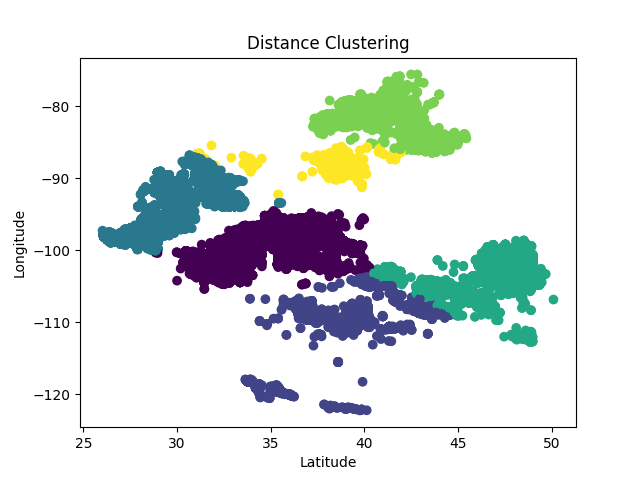
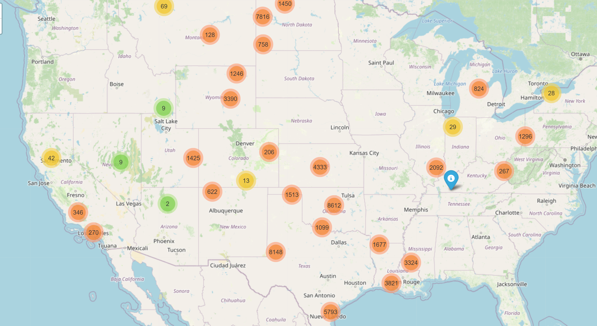
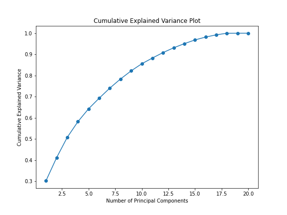
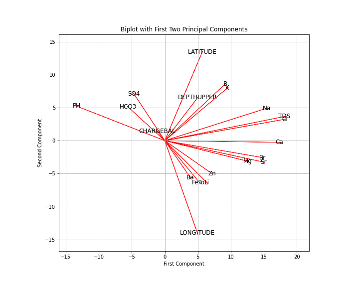
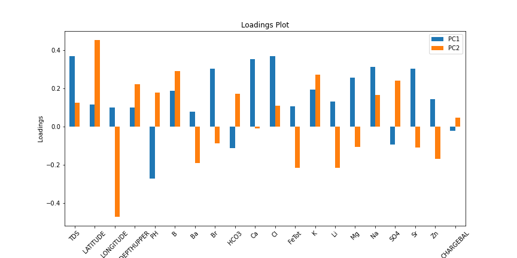
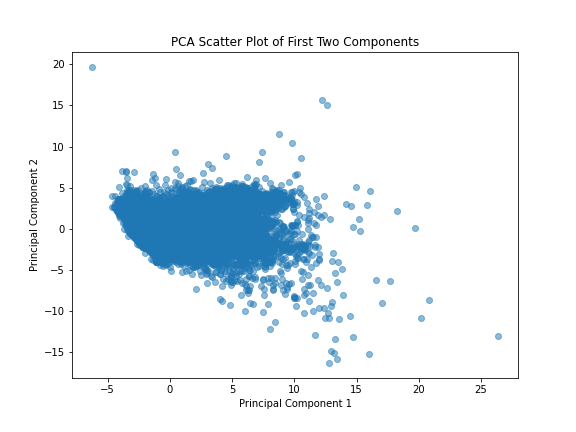
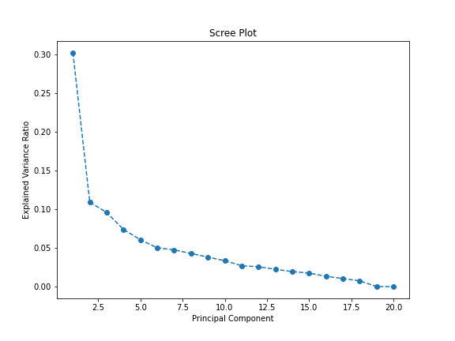

# Geochemical Data Analysis and Lithium Concentration Prediction Using Machine Learning Techniques

## Introduction

In this report, we present a comprehensive analysis of geochemical data of produced water samples, obtained from the U.S. Geological Survey (https://www.sciencebase.gov/catalog/item/64fa1e71d34ed30c2054ea11). Our objective is to apply statistical and machine learning techniques to predict Lithium (Li) concentrations. This analysis encompasses data preprocessing, Principal Component Analysis (PCA), clustering analysis, regression analysis, and hypothesis testing.

## Data Preparation

The raw dataset was subjected to several preprocessing steps to ensure its readiness for analysis:

- **General Cleaning**: Irrelevant columns, such as identifiers and categorical data, were removed. This step was crucial to focus the analysis on quantitative geochemical features.
- **Well Type Filtering**: To ensure our study focused on the high-salinity produced water typical in oil and gas operations, we excluded well samples from coal, injection, and geothermal plays. This approach keeps our analysis relevant to the typical environmental and production challenges in the oil and gas industry.
- **Basin Categorization**: Well samples were categorized based on the basin they belong to. This categorization helps to group samples by geographical and geological features.
- **Technical Cleaning**: In the dataset preprocessing phase, observations with Total Dissolved Solids (TDS) levels below 10,000 parts per million (ppm) were excluded. This threshold was established based on the consideration that waters with TDS levels below this mark are typically characterized as brackish and are often subjected to treatment processes for various uses, including agricultural and industrial applications. Conversely, waters with TDS exceeding 10,000 ppm are generally associated with greater environmental challenges, requiring more rigorous management strategies to mitigate potential adverse ecological impacts. By focusing on samples with higher TDS levels, the analysis targets the subset of produced water that is more likely to raise environmental and disposal concerns, thus providing a more relevant framework for examining geochemical data in the context of environmental science and hydrology.
- **Imputation Strategy**:  For geochemical datasets, where the variables often exhibit complex interdependencies, simplistic imputation methods such as substitution by mean, median, or extremities like minimum and maximum values may not adequately capture the intrinsic variability and can potentially introduce biases. To address the missing data in our dataset, we utilized an Iterative Imputer, employing a RandomForestRegressor as the estimator. This advanced imputation technique considers the entire variable distribution and the stochastic nature of the dataset, thereby preserving the inherent multivariate relationships among geochemical parameters. It is especially critical in PCA, which requires a complete dataset as missing values can significantly distort the principal components derived from the analysis.

## Clustering Analysis

A clustering analysis using the K-Means algorithm was conducted, revealing distinct spatial clusters in the data:

- **Spatial Clustering**: The latitude and longitude were used to identify six clusters, potentially indicating geochemical similarities based on location.

*Figure 1: Spatial clustering of well samples.*

- **Geo-visualization**: A geographic map with clustered data points was created using Folium, offering insights into spatial patterns related to geochemical features.

*Figure 2: Map visualization of clustered well samples.*

- **Lithium Clustering**: To analyze the distribution of Lithium (Li) concentrations and identify clusters within the dataset, we performed the following steps:
    - Initialized an imputer to handle missing values in the Lithium concentration data using the IterativeImputer with a RandomForestRegressor. Each missing value was imputed based on the known Lithium concentrations within the same basin.
    - Categorized the data into two types: "Known" and "Imputed", indicating whether the Lithium concentration values were observed or imputed.
To determine the optimal number of clusters for clustering Lithium concentrations, we calculated the sum of squared errors (SSE) for a range of cluster numbers using the KMeans algorithm. The "elbow method" was applied to identify the point where the rate of decrease in SSE slowed down, suggesting an optimal number of clusters.
Using four clusters determined from the elbow method, we applied the KMeans algorithm to cluster the Lithium concentrations. We visualized the clustering results using a scatter plot, where each data point represents a sample. The data points were color-coded based on their cluster assignment and marker style was used to differentiate between known and imputed data.

Additionally, we created an interactive scatter plot using hvplot to visualize the clustering results. This plot allows for better exploration of Lithium concentration clusters and provides information about each data point upon hovering.

Furthermore, we created a geographical distribution map using Folium to visualize the spatial distribution of Lithium concentrations across different basins. Each data point on the map represents a sample location, with the marker size proportional to the Lithium concentration.

## Regression Analysis

We explored the relationships between Li concentration and other geochemical parameters using regression analysis:

- **Li Concentration vs. TDS**: A statistically significant positive correlation was identified, implying a relationship between increased TDS and Li concentration.
- **Li Concentration vs. Depth**: Analysis showed a positive correlation, suggesting that depth might influence Li concentration in the wells.

## Test Hypothesis

Statistical tests were conducted to verify the significance of the relationships observed:

- **Li and TDS**: The strong correlation was confirmed to be statistically significant, indicating a genuine relationship across the dataset.
- **Li and Depth**: The positive correlation was statistically significant, albeit with a lower correlation coefficient compared to the Li-TDS correlation.

## Principal Component Analysis (PCA)

PCA was performed after standardizing the data, and the results were visualized through various plots:

*Figure 3: Cumulative Explained Variance Plot*

*Figure 4: PCA Biplot with First Two Principal Components*

*Figure 5: PCA Loadings Plot*

*Figure 6: PCA Scatter Plot of First Two Components*

*Figure 7: PCA Scree Plot*

### Discussion of PCA Plots

- **Scree Plot**: The scree plot shows that the first two principal components account for most of the variability in the data. It suggests that we could use just these two components for a simpler, yet still informative, analysis. This method effectively reduces the complexity of the data without losing key information.
- **Cumulative Explained Variance Plot**: This plot suggests that as the number of principal components increases, the cumulative explained variance reaches a point of diminishing returns after approximately the 15th component. This indicates that beyond this point, each additional component contributes less to the overall variance explained. Hence, retaining the first 15 components could be sufficient to capture the vast majority of information present in the dataset. Considering both scree and cumulative explained variance plots, it's a trade-off between simplicity (fewer components) and completeness of information (more components). For machine learning purposes, where we might be concerned with overfitting and computational efficiency, we might choose fewer components. However, for comprehensive data analysis, we may decide to retain more components to ensure we're capturing as much information as possible. Therefore, while the first two components are important, examining the point at which the cumulative variance starts to plateau (around the 15th component in this case) helps us make an informed decision on how many components to retain without unnecessarily complicating the model. It's important to align this choice with the specific goals and constraints of the analysis or the predictive modeling task at hand.

- **PCA Scatter Plot**: Suggested that while there is a spread of data points, there might not be distinct groupings when considering only the first two principal components.
- **Loadings Plot**: Showed the contribution of each variable to the principal components, indicating which features influence the components the most.
- **Biplot**: The length of a vector reflects the strength of a feature's impact on the principal components, with longer vectors indicating a stronger influence on the dataset variability. The direction of a vector indicates its correlation with each principal component. Features closer to the axes are more aligned with that principal component, suggesting that they are a significant contributor to the variance captured by that specific principal component. TDS and Cl, Sr and Ca, B and K have vectors pointing roughly in the same direction, suggesting they may be correlated in the dataset. This supports the idea of potential redundancy if these features are used together in a predictive model, which could lead to data leakage or multicollinearity issues. Features like charge balance, HCO3, and pH have vectors that are shorter and point in different directions compared to the majority, indicating they might contribute less to the variation explained by the first two principal components or are less correlated with other variables.

## Machine Learning Implications

- **Feature Correlation**: In predictive modeling, particularly within machine learning frameworks, the presence of highly correlated features can lead to redundancy and overfitting, commonly referred to as multicollinearity. Our exploratory data analysis indicates significant collinearity among several geochemical parameters; for instance, potassium (K) displays a strong positive correlation with boron (B), while calcium (Ca) is similarly correlated with strontium (Sr), and total dissolved solids (TDS) with chloride (Cl). To mitigate the risk of data leakage and ensure model robustness, it is prudent to consider the inclusion of only one variable from each correlated pair in the feature set. This practice enhances the generalization ability of the predictive model and improves interpretability by minimizing the effect of multicollinearity.
- **PCA for Dimensionality Reduction**: PCA can serve as a feature engineering step, reducing the dimensionality and removing multicollinearity, which is advantageous for machine learning models.
